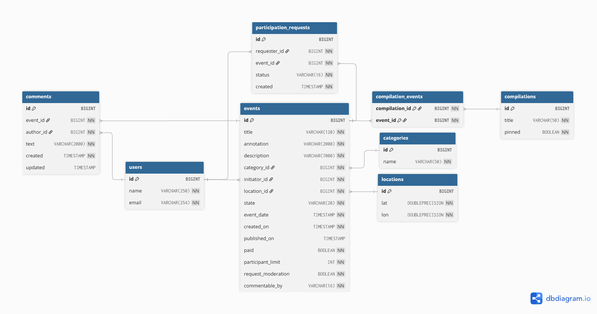

https://github.com/cepheil/java-explore-with-me/pull/4

#  Explore-with-me
Приложение **Explore with me** — афиша. В этой афише можно предложить какое-либо событие от выставки до похода в кино и собрать компанию для участия в нём.

---  
### Структура проекта
Проект состоит из двух основных модулей:

#### EWM-Service
Основной сервис приложения, который включает в себя:
- Публичный API для всех пользователей
- Приватный API для зарегистрированных пользователей
- Административный API для управления приложением

#### Stats-Service
Сервис статистики, который:
- Собирает информацию о просмотрах событий
- Предоставляет статистические данные по запросам
--- 

### ER-диаграмма



## 🗨️ Feature: Комментарии к событиям (comments)

Функциональность реализована в рамках дополнительного этапа дипломного проекта **Explore With Me**.  
Добавлена возможность пользователям оставлять комментарии к событиям, редактировать и удалять их,  
а также получать списки комментариев по событиям и авторам.  
Администраторы могут модерировать комментарии, удаляя их при необходимости.

### 🔧 Бизнес-логика и правила
- **Комментирование доступно только для опубликованных событий.**
- Поле `commentableBy` в `Event` определяет политику комментирования:
    - `ALL` — комментировать могут все пользователи;
    - `PARTICIPANTS` — только пользователи с подтверждённой заявкой на участие.
- Пользователь может:
    - создавать комментарии к событиям, доступным по политике;
    - редактировать **только свои** комментарии;
    - удалять собственные комментарии.
- Администратор может удалять **любые** комментарии.
- При создании/обновлении выполняются проверки:
    - `text` — не пустой, длина ≤ 2000 символов;
    - событие существует и опубликовано;
    - пользователь и событие существуют;
    - при политике `PARTICIPANTS` — заявка должна быть в статусе CONFIRMED.
- Публичные запросы возвращают комментарии **только к опубликованным событиям**.
- Списки упорядочены по полю `created` в порядке убывания.

---

 ### Эндпоинты API

#### 🔹 Публичные
```http
GET /events/{eventId}/comments?from={int}&size={int}&authorId={optional}&rangeStart={optional}&rangeEnd={optional}
```
Возвращает список комментариев к опубликованному событию.  
Параметры `authorId`, `rangeStart`, `rangeEnd` необязательны.

#### 🔹 Пользовательские
```http
GET /users/{userId}/comments?from={int}&size={int}&rangeStart={optional}&rangeEnd={optional}
```
Возвращает список комментариев, созданных пользователем.
##
```http
POST /users/{userId}/events/{eventId}/comments
```
Создаёт новый комментарий.  
Тело запроса:
```json
{ "text": "Отличное событие!" }
```
##

```http
PATCH /users/{userId}/comments/{commentId}
```
Обновляет текст комментария (только автор может редактировать).
##

```http
DELETE /users/{userId}/comments/{commentId}
```
Удаляет комментарий, принадлежащий пользователю.

#### 🔹 Административные
```http
DELETE /admin/comments/{commentId}
```
Удаляет комментарий независимо от автора и события.

---
### 🧩 Используемые классы и DTO

| Компонент | Назначение |
|------------|------------|
| `Comment` | JPA-сущность комментария (`id`, `event`, `author`, `text`, `created`, `updated`) |
| `CommentableBy` | Enum-политика (`ALL`, `PARTICIPANTS`) |
| `CommentDto` | DTO для вывода комментариев |
| `CommentTextDto` | DTO для создания/обновления комментариев |
| `CommentParam` | DTO для параметров фильтрации (`rangeStart`, `rangeEnd`, `from`, `size`) |
| `CommentMapper` | Конвертация между Entity и DTO |
| `CommentService` / `CommentServiceImpl` | Логика проверки и работы с комментариями |
| `CommentController` | REST-контроллер, объединяющий public, private и admin-эндпоинты |

---

 